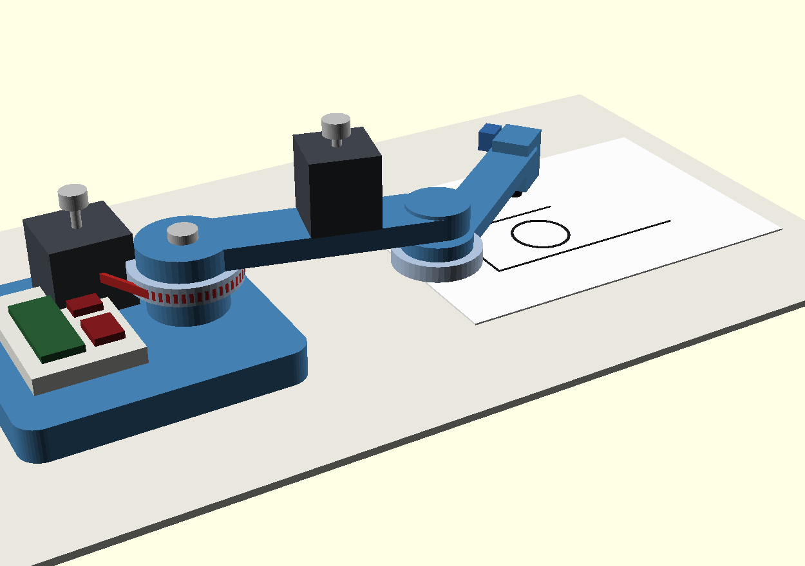

# SCARA Drafter — a robot arm that draws CAD drawings

A 3D-printed SCARA robot arm that picks up a pen and drafts real CAD drawings
(DXF files exported straight from Onshape) onto A5 paper. Design a part in
CAD → hit export → a robot you built draws it in ink.

Built as a mechatronics internship portfolio piece. ~$160 CAD in parts;
every structural component printed on a Bambu P1S.


*Concept mockup (OpenSCAD, real proportions): base with electronics tray, belt-driven
shoulder, elbow motor riding link 1, pen carriage drawing on A5.*

## The demo loop

```
Onshape sketch ──export──▶ DXF ──parse──▶ toolpath ──inverse kinematics──▶
joint angles ──WiFi──▶ Pico W ──step pulses──▶ steppers ──belts──▶ pen on paper
```

Every arrow in that pipeline is something I built and can explain.

## Architecture

- **Topology:** SCARA — two rigid printed links swinging in a horizontal
  plane (gravity stays out of the drawing plane; precision comes cheaper),
  plus a micro-servo pen lift. ~130 mm links → covers an A5 sheet.
- **Actuation:** 2× NEMA17 steppers through printed GT2 belt reductions
  (~3:1) — reduction multiplies resolution and torque, and belt tension is
  the main precision tuning knob.
- **Brains, split in two:** the PC does the thinking (DXF parsing, path
  planning, IK — Python), the Pico W does the doing (real-time step pulse
  generation, limits, fail-safe stop). Same distributed pattern as my
  [slam-rover design study](https://github.com/nishantshah0/slam-rover).
- **Calibration philosophy:** the arm draws a test square, I measure it with
  calipers, software corrects the model — repeat until a 50 mm square is a
  50 mm square. Measured, not assumed.

## Build phases

| Phase | Weeks | Deliverable |
|---|---|---|
| 0 — Design & order | 0–1 | Parts ordered; base/links/carriage CAD'd; bearing-fit coupon printed |
| 1 — Electronics bench | 1–2 | Both joints sweeping smoothly under command; pen lift working |
| 2 — Assembly & IK | 2–3 | Arm moves pen to commanded (x, y); first drawn line |
| 3 — Precision | 3–5 | **One clean 50 mm square** (the project's summit — tuning journey logged) |
| 4 — DXF pipeline | 5–6 | Draws a real Onshape-exported drawing. The money demo |
| 5 — Stretch | — | Handwriting mode; whiteboard tile; cycloidal gearbox joints v2 |

Full milestone ladders: [docs/roadmap.md](docs/roadmap.md) ·
Parts: [docs/shopping-list.md](docs/shopping-list.md) ·
Why-decisions: [docs/decisions.md](docs/decisions.md) ·
Failure modes: [docs/risks.md](docs/risks.md) ·
War stories: [docs/debugging-log.md](docs/debugging-log.md)

## Status

Phase 0 — design in progress (July 2026).
